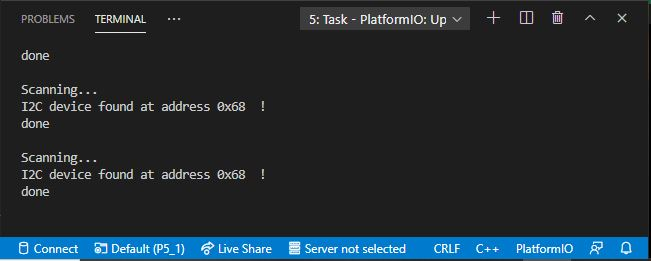

# PRACTICA 5_1  : Buses de comunicación I (introducción y I2c)

## 1.Salida Del Terminal

En la salida del puerto serie se aprecia un escaneo de esclavos I2c, cuyo mensaje al haber encontrado alguno conectado es "I2C device found at address 0x".
Si el código de escaneo no detecta ningún esclavo, por el terminal aparece el mensaje "No I2C devices found".

En mi caso, he utilizado el dispositivo I2c de referencia "MPU6050", el cual se ubica en la dirección 0x68.

## 2.Funcionamiento

El código que se nos presta para el ejercicio 1 es básicamente un escaner de dispositivos I2C. Para desarrollarlo, se utilizan 2 variables tipo byte que simularán un error, si se comete a la hora de escanear, y la dirección en hexadecimal de los dispositivos I2c que se encuentren. Además, se utiliza un contador de tipo int, el cual cuenta el número de dispositivos I2c escaneados.

Para realizar el escaneo, este es programado mediante un for, donde el iterador será la dirección del dispositivo I2c y, que, en este caso, se podrá reiterar hasta 126 direcciones. A continuación, se emplean sentencias condicionales para distribuir las diferentes posibilidades: dispositivo encontrado, no encontrado o erróneo. 